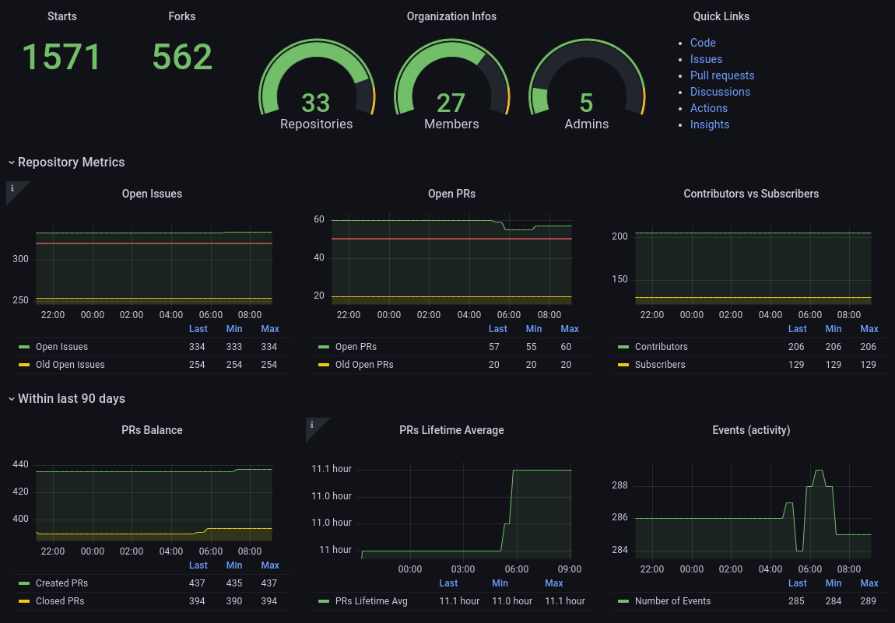

# CommunityMon
This project was created with the goal of collecting metrics from relevant tools and representing them in nice dashboards, which can ultimately provide insights for maintainers and quickly accessible data to support Open Source project management.



# Architecture
The project is composed by a stack of containers, which work together to collect metrics, store data in a time series database and finally represent them in dashboards.

The stack is configured in a `docker-compose.yaml` file, which is processed by the [podman-compose](https://github.com/containers/podman-compose) tool.

## Containers
### prometheus
[prometheus](https://prometheus.io/) is the core solution chosen for this project. It is a robust and, at the same time, a light tool used to collect many useful metrics and store them in time series database, which can be easily consumed by [grafana](https://grafana.com/oss/grafana/).

prometheus is a tool which was initially designed to collect metrics from web applications. However, it permits creation of custom metrics, which makes it capable to monitor almost everything.

All the prometheus configuration is centralized in the `prometheus.yml` file. Examine this file is the prometheus documentation for more details.

### pushgateway
[pushgateway](https://github.com/prometheus/pushgateway) is under the prometheus umbrella and was created to act as a proxy between prometheus and the monitored asset which doesn't natively provide metrics in the format required by prometheus.

Using pushgateway is also a straightforward option for send ing custom metrics to prometheus time series database. In the context of this project, where the volume of data is not large and the metrics are collected by scripts, pushgateway fits very well.

### grafana
[grafana](https://grafana.com/oss/grafana/) is a very popular and useful solution to create nice dashboards. This solution converted the boring task of traditionally creating dynamic charts and dashboards in a easy and intuitive task. Useful dashboards can be created with the minimal effort and time.

## API Scripts
Currently, the project has scripts which interact with the Github Rest API to collect some metrics and send to `pushgateway`.

Any contribution to include support for more APIs or even improve what is already in place is always more than welcome!! ; )

## Workflow
Basically, `scripts` interact with the tools' APIs to collect relevant data and send them to `pushgateway`. Then `prometheus` consults the `pushgateway` to get aware of the custom metrics and store them on its time series database. Finally, `grafana` can access the `prometheus` data and use the available metrics on its dashboards.

# Get Started
It is pretty straightforward to start using this stack. You only need to follow some few steps to start monitoring your Open Source project.
## Requirements
### Packages
#### Fedora
```shell
sudo dnf install -y git podman-compose
```

### Users
It is recommended to create a limited user to run this stack.
```shell
sudo useradd community-mon
```

### Content
```shell
sudo mkdir /opt/CommunityMon
sudo chown community-mon:community-mon /opt/CommunityMon
```

#### Clone the Repository
**_NOTE:_** At this point, it is better to start a new session using the newly created user (community-mon).

```shell
cd /opt/CommunityMon
git clone https://github.com/marcusburghardt/CommunityMon.git
```

#### Python Modules
Install the Python modules used by the API scripts:
```shell
pip install pyyaml PyGithub prometheus_client
```

### Custom Settings
It is likely that you need to adjust some settings applicable to your context. Therefore, the relevant configuration files are defined in the `.gitinore` while the respective sample files are located in `Sample_Files` folder. Let's copy them to the proper locations.
```shell
cp /opt/CommunityMon/CommunityMon/Sample_Files/apis_apis.yml /opt/CommunityMon/CommunityMon/APIs/apis.yml
cp /opt/CommunityMon/CommunityMon/Sample_Files/stack_dot_env_grafana /opt/CommunityMon/CommunityMon/Stack/.env_grafana
cp /opt/CommunityMon/CommunityMon/Sample_Files/stack_dot_GRAFANA_ADMIN_PASSWORD /opt/CommunityMon/CommunityMon/Stack/.GRAFANA_ADMIN_PASSWORD
```

**_NOTE:_** Don't forget to adjust the grafana admin password in `.GRAFANA_ADMIN_PASSWORD`.

### SELinux
It is necessary to properly set the SELinux file context for the data folder in order to allow the prometheus container to store the data.
```shell
sudo chcon -R -t container_file_t /opt/CommunityMon/CommunityMon/Stack/prometheus/data
```

**_NOTE:_** Please, do not set SELinux to permissive mode. If necessary, take a look in the `audit2allow` and `getsebool` commands. They could be handy.

### Optional Settings
#### Crond
It is necessary to trigger the script in order to collect the metrics and send them to `Pushgateway`. You can do it manually but one simple way to collect and send metrics without human interaction in through a cron job. You can use the provided sample file as reference:
```shell
sudo cp /opt/CommunityMon/CommunityMon/Sample_Files/cron_communitymon /etc/cron.d
```
**_NOTE:_** You can also define a cron task directly to the `community-mon` user using the `crontab -e` command.

#### NGINX as Reverse Proxy
If you want to provide external access to the dashboard, you have to make it accessible. It is recommended to use a NGINX as frontend to your Stack in order to easily enable HTTPs and protect the backend services.
```shell
sudo dnf install nginx certbot python3-certbot-nginx
sudo systemctl enable nginx
sudo systemctl start nginx
```

Use the `nginx_communitymon.conf` file from the `Sample_Files` folder to get a reference. There is also the `nginx_hardening.conf`, which is recommended to be checked and implemented.

**_NOTE:_** Check the [certbot](https://certbot.eff.org/) documentation to get a [Let's Encrypt](https://letsencrypt.org/) certificate.

### Tokens
#### Github
Read the respective documentation to generate your token:
* https://docs.github.com/en/authentication/keeping-your-account-and-data-secure/creating-a-personal-access-token

Once the token is generated, create a file in a place you consider secure, with the following content:
```
[DEFAULT]
github_token = ghp_*****
```
Inform the absolute path for this file in the `apis.yml` file.

## Start
Navigate to the folder where the `docker-compose.yaml` file is located and execute the following command:
```shell
podman-compose up -d
```
If you close the session where the containers were started, `systemd` will detect and stop any container associated with the respective session. Therefore, if you need the containers running even after the logout, enable the `linger` functionality for the user:
```shell
loginctl enable-linger
```
## Updates
Whenever you desire to update the stack, just follow these few simple steps:
```shell
cd /opt/CommunityMon/CommunityMon
git pull
cd /opt/CommunityMon/CommunityMon/Stack
podman-compose down
podman-compose up -d
```
### Access the tools
* Grafana: [locahost:3000](http://localhost:3000)
* Prometheus: [locahost:9090](http://localhost:9090)
* Pushgateway: [locahost:9091](http://localhost:9091)

### Collect the first metrics
The following example is collecting metrics from the Github `ComplianceAsCode` organization and the `ComplianceAsCode/content` repository, considering the parameters from `apis.yml` file. The last parameter informs the action `push-metrics-prometheus` which means that the collected metrics will be sent to Prometheus Pushgateway:
```shell
./CommunityMon/APIs/github_monitor.py -o ComplianceAsCode -r ComplianceAsCode/content -a push-metrics-prometheus
```

Check the `Metrics.md` file in `Docs` folder for more information about the collected metrics.

### Explore the scripts
The scripts can also be used to collect data for ad-hoc analysis. Check the `Examples.md` file in `Docs` folder for inspiration. ;)
